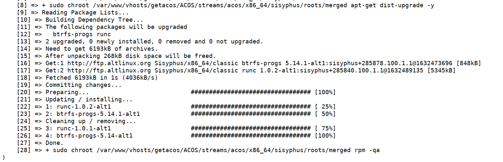
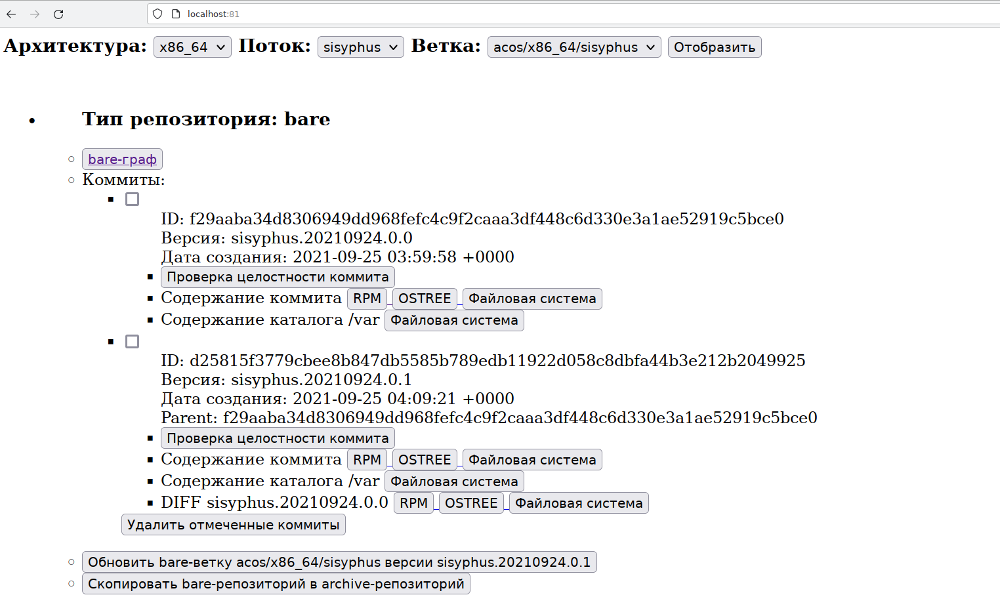
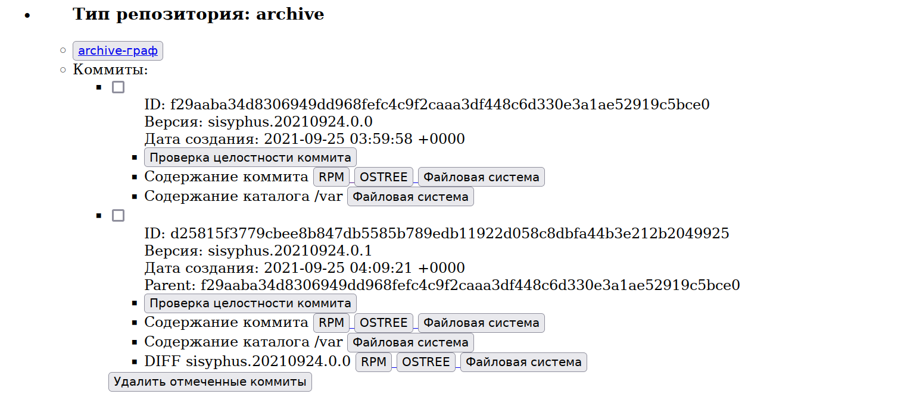
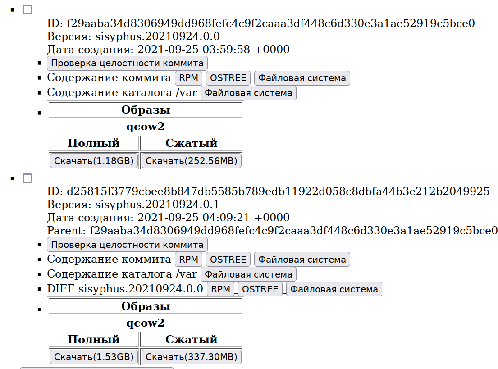
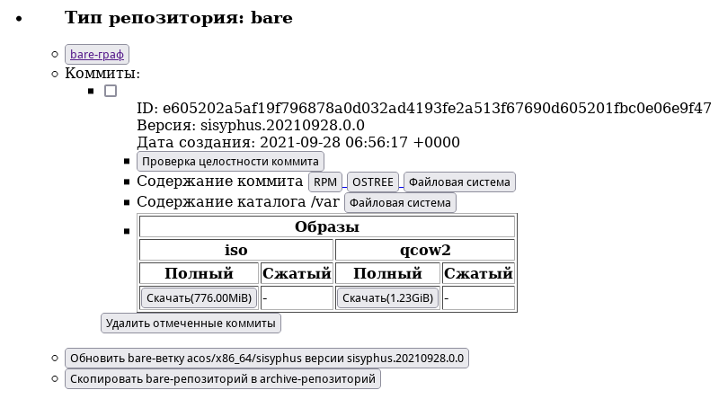

# Работа с административным интерфейсом

## Установка начальной версии рeпозитория sysyphus.YYYYMMDD.0.0

Установите репозиторий mkimage-profiles@keremet в каталог, где находится поддиректорий данного (getaltcos) репозитория:
```
git clone http://git.altlinux.org/people/keremet/packages/mkimage-profiles.git -b altcos
```

Перейдите в терминальном режиме в каталог [ostree/shell/](https://github.com/alt-cloud/getaltcos/tree/release_0.0.1/ostree/shell) и запустите команду
```
$ ./mkimage-profiles.sh sisyphus
...
23:23:52 initializing BUILDDIR: build/
23:23:52 preparing distro config: build/distcfg.mk
23:24:39 starting image build: tail -f build/build.log
23:28:57 done (4:17)
** image: .../getaltcos/ALTCOS/streams/altcos/x86_64/sisyphus/mkimage-profiles/altcos-20210924-x86_64.tar [1,1G]
23:28:57 cleaning up after build
```
В результате работы команды в директории `ALTCOS/streams/altcos/x86_64/sisyphus/mkimage-profiles/`
появятся файлы  `altcos-<YYYYMMDD>-x86_64.tar*` с символическими ссылками:
```
-rw-r--r-- 1 kaf kaf 1073920000 сен 24 23:28 altcos-20210924-x86_64.tar
-rw-r--r-- 1 kaf kaf       3895 сен 24 23:24 altcos-20210924-x86_64.tar.cfg
-rw-r--r-- 1 kaf kaf     281331 сен 24 23:28 altcos-20210924-x86_64.tar.log
lrwxrwxrwx 1 kaf kaf         24 сен 24 23:28 altcos-latest-x86_64.tar -> altcos-20210924-x86_64.tar
lrwxrwxrwx 1 kaf kaf         22 сен 24 23:28 mkimage-profiles.tar -> altcos-latest-x86_64.tar
```

В браузере наберите URL: `http://localhost:81/`. Отобразится начальный интерфейс:


Кликните по кнопке `Создать ветку altcos/x86_64/sisyphus`.
В отдельной вкладке откроется интерфейс, в котором через несколько десятков секунд
появится результат выполнения команды:
```
/var/www/vhosts/altcos/ostree/bin/rootfs_to_repo.sh altcos/x86_64/sisyphus
...
```

Вернитесь на вкладку административного интерфейса и перегрузите страницу `<ALT><Shift>R`.
В интерфейсе отобразится первый собранный в репозитории bare коммит версии `sysyphus.YYYYMMDD.0.0`:


Покликайте по кнопкам созданной версии соммита. В отдельной вкладке будут отображаться результаты выполнения команд.

## Формирование следующей минорной версии репозитория sysyphus.YYYYMMDD.0.1

Кликните кнопку `Обновить bare-ветку altcos/x86_64/sisyphus версии sisyphus.20210924.0.0`.
В отдельной вкладке будут отображаться результаты выполнения команд
```
apt-get update
apt-get dist-upgrade
```
Если обновления отсутствуют, новая ветка не формируется.

Если обновления есть, сформируется следующая версия репозитория `sysyphus.YYYYMMDD.0.1`.


Вернитесь на вкладку административного интерфейса и перегрузите страницу `<ALT><Shift>R`.
В интерфейсе отобразится второй собранный в репозитории bare коммит версии `sysyphus.YYYYMMDD.0.1`:


## Копирование коммитов из bare-репозитория в archive-репозиторий

Кликните кнопку `Скопировать  bare-репозиторий в archive-репозиторий`.
В отдельной вкладке будут отображаться результаты выполнения команд.

Вернитесь на вкладку административного интерфейса и перегрузите страницу `<ALT><Shift>R`:
В интерфейсе отобразятся скопированные в репозитории `archive` коммиты версий
`sysyphus.YYYYMMDD.0.0`, `sysyphus.YYYYMMDD.0.1`.


## Сборка QCOW2 образов

В терминальном интерфейсе перейдите в каталог `ostree/shell/` и запустите команду
```
$ sudo ./make_qcow2.sh altcos/x86_64/sisyphus <commitId>
...
sent 13,720,815 bytes  received 2,628 bytes  27,446,886.00 bytes/sec
total size is 13,707,601  speedup is 1.00
Create compressed image (several minutes) (y/n)? y
  100 %     259,8 MiB / 1 254,8 MiB = 0,207   3,0 MiB/s       6:58

```
Где `<commitId>` - идентификатор коммита первой версии.

Для сборки `qcow2`-образа второй версии повторите команду с идентификатором коммита второй версии.

Вернитесь на вкладку административного интерфейса и перегрузите страницу `<ALT><Shift>R`.
В интерфейсе отобразится список доступных для загрузки образов.


Для загрузки образов на локальный компьютер кликните по соответствующей кнопке `Скачать`.

## Сборка ISO образов  

В терминальном интерфейсе перейдите в каталог `ostree/shell/` и запустите команду
```
$ ./make_iso.sh altcos/x86_64/sisyphus <commitId>
...
15:47:44 initializing BUILDDIR: build/
15:47:44 preparing distro config
15:47:53 starting image build (coffee time)
15:52:11 done (4:18)
** image: ~/getaltcos/ALTCOS/streams/altcos/x86_64/sisyphus/images/iso/installer-altcos-20210930-x86_64.iso [779M]
make: выход из каталога «/home/keremet/mkimage-profiles»
```
Где `<commitId>` - идентификатор коммита первой версии.

Для сборки `iso`-образа второй версии повторите команду с идентификатором коммита второй версии. 

Вернитесь на вкладку административного интерфейса и перегрузите страницу `<ALT><Shift>R`.
В интерфейсе отобразится список доступных для загрузки образов.



