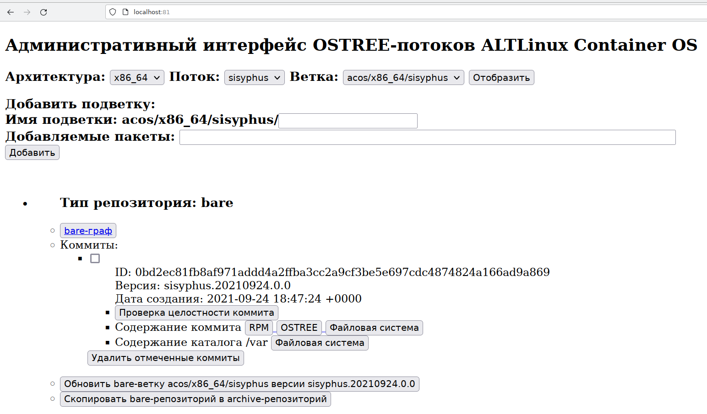

# Работа с интерфейсом

Установите в каталог, где находится поддиректорий данного репозитория репозиторий
mkimage-profiles@keremet:
```
$ git clone http://git.altlinux.org/people/keremet/packages/mkimage-profiles.git -b acos
```

Перейдите в терминальном режиме в каталог [/ostree/shell/](https://github.com/alt-cloud/getacos/tree/release_0.0.1/ostree/shell) и запустите команду
```
$ ./mkimage-profiles.sh sisyphus
...
23:23:52 initializing BUILDDIR: build/
23:23:52 preparing distro config: build/distcfg.mk
23:24:39 starting image build: tail -f build/build.log
23:28:57 done (4:17)
** image: .../getacos/ACOS/streams/acos/x86_64/sisyphus/mkimage-profiles/acos-20210924-x86_64.tar [1,1G]
23:28:57 cleaning up after build
```
В результате рабоьы команды в директории `/ACOS/streams/acos/x86_64/sisyphus/mkimage-profiles/`
появиься файлы  `acos-<YYYYMMDD>-x86_64.tar*` с символическими ссылками:
```
-rw-r--r-- 1 kaf kaf 1073920000 сен 24 23:28 acos-20210924-x86_64.tar
-rw-r--r-- 1 kaf kaf       3895 сен 24 23:24 acos-20210924-x86_64.tar.cfg
-rw-r--r-- 1 kaf kaf     281331 сен 24 23:28 acos-20210924-x86_64.tar.log
lrwxrwxrwx 1 kaf kaf         24 сен 24 23:28 acos-latest-x86_64.tar -> acos-20210924-x86_64.tar
lrwxrwxrwx 1 kaf kaf         22 сен 24 23:28 mkimage-profiles.tar -> acos-latest-x86_64.tar
```

В браузере наберите URL: `http://localhost:81/`. Отобразится начальный интерфейс:


Кликните по клавише `Создать ветку acos/x86_64/sisyphus`.
В отдельной вкладке откроется интерфейс в котором через несколько десяток секунд
появится результат выполнения команды:
```
/var/www/vhosts/getacos/ostree/bin/rootfs_to_repo.sh acos/x86_64/sisyphus
...
```

Вернитесь на вкладку административного интерфейса и перегрузите страницу `<ALT><Shift>R`:


Покликайте по кнопкам созданной версии соммита. В отдельной вкладке будут отображаться результаты выполнения команд.

