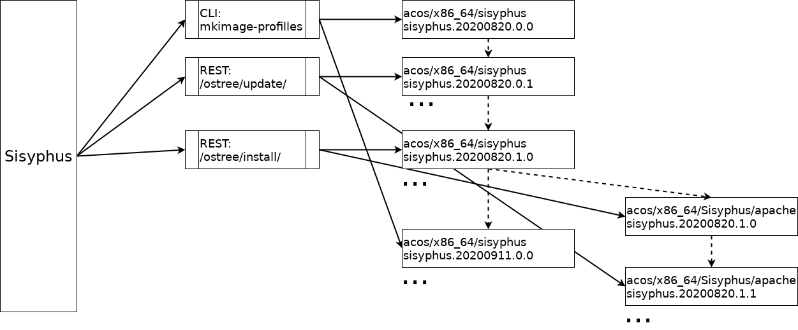

# Режимы работы с репозиторием 


## Формирование потоков (`stream`), веток (`ref`), версий (`version`) ACOS ostree репозиториев 

### Глоссарий:
- `Поток` (`stream`) - последовательной версий (commit) для определенной версии дистрибутива ALTLinux: `sisyphus`, `p10`, `p11`, .... Имя потока присутствует в ветке `acos/x86_64/p10` и версии (`p10.20210820.2.12`) ostree-репозиторий
- `Ветка`(`ref`) - основной поток ведущийся администратором имеет ветку `acos/<arch>/<stream>`:
  *  `acos/x86_64/sisyphus`, `acos/ppc64le/sisyphus`, ...
  *  `acos/x86_64/p10`, `acos/ppc64le/p10`, ...
  * ...
  
  Администратор или пользователи могут через REST-интерфйес создавать подветки со своим набором основных пакетов:
  *  `acos/x86_64/Sisyphus/apache2`, `acos/ppc64le/Sisyphus/ruby`, ...
  *  `acos/x86_64/P10/apache2`, `acos/ppc64le/P10/ruby`, ...
  * ...

- `Версия` - определенный `commit` репозитория которому присвоена версия по формату 
`<поток>.<дата_формировния>.<мажорная_версия>.<минорная_версия>`:
  * `sisyphus.20210820.0.0`, ...
  * `p10.20210903.0.0`, ...  

### Режимы формирования ACOS ostree репозиториев

В настоящий момент предполагается два основных режима работы с репозиториями `ACOS ostree`:
- (Пере)генерация репозитория через `mkimage-profiles с` созданием новой версии даты репозитория 
- Минорные и мажорные обновления репозиториев  через команду `apt-get`

Каждый поток и его аппаратная реализация ведется в отдельной ветке репозитория:
- `sisyphus` - `acos/x86_64/sisyphus`, `acos/ppc64le/sisyphus`, ...
- `p10` - `acos/x86_64/p10`, `acos/ppc64le/p10`, ...

При создании нового потока/репозитория (`sisyphus`, `p10`, `p11`, ...) необходимо обеспечить генерацию основного дерева репозитория через `mkimage-profiles`.
Собранным образам и репозиториям будут присваиваться версии `<дата_сборки_tar_файла>.0.0`.
Образы и репозитории собираются по состоянию пакетной базы на момент сборки. 
Например версия потока `sisyphus`, собранная 20 августа 2021 года получает версию `sisyphus.20210820.0.0`. 

Далее начинается процесс постоянного обновления пакетной базы в репозиториях пакетов 
(http://ftp.altlinux.org/pub/distributions/ALTLinux/Sisyphus/, http://ftp.altlinux.org/pub/distributions/ALTLinux/p10/, ...). Это должно приводить в обновлению пакетов в репозиториях `ACOS ostree`.
Каждое обновление должно обеспечивать формирование новой версии (commit) с новой версией
`sisyphus.20210820.0.1`, `sisyphus.20210820.0.2`, ...

Если администратором потоков принимается решение о смене состава пакетов (добавление, удаление) в репозитории, то это должно приводить к формированию версии репозитория `ACOS ostree` с новой мажорной версией:
`sisyphus.20210820.1.0`, `sisyphus.20210820.2.0`, ...

Если администратором потоков принимается решение о более существенных изменениях в репозитории `ACOS ostree` приводящей к существенному изменению состава пакетов и из разворачиванию, то формируется ноавя версии (commit) с новой версией даты: `sisyphus.20210911.0.0`, `sisyphus.20220112.0.0`, ...

Генерация tar-файла через `mkimage-profiles` длительный и ресурсоемкий процесс включающий полный пересчет sha256 сумм всех файлов и добавления файлов с новыми суммами в каталог `/objects/` репозитория.

При изменении минорных и мажорных версий нет смысла через `mkimage-profiles` заново пересобирать и размещать в репозитории все дерево файловой системы. Достаточно в последнем разворачивании (`deploy`) воспользоваться командами
- для минорных изменений:
```
apt-get update
apt-get dist-upgrade
```
- для мажорных изменений
```
apt-get update
apt-get install ...
apt-get remove ...
```

и добавить изменения в новую минорную или махорную версию `ACOS ostree` репозитория.

Этот подход:
- существенно уменьшит время и необходимые аппартные ресурсы для формирования новой версии
-  позволит автоматизировать логировние изменений пакетной базы на основе вывода команд `apt-get update`, `apt-get instal ...`, `apt-get remove`
- за счет малого времени формирования нового репозитория позволит его применить для формирования пользовательский веток репозитория: `acos/x86_64/P10/Apache`, `acos/ppc64le/P10/ruby`, ...



 
## Перегенерация репозитория через mkimage-profiles

Перегенерация репозитория через `mkimage-profiles` проводится:
-  при первоначальной создании образов и репозитория для новых потоков `p10`, `p11` 
- при существенных изменениях в пакетной базы, когда формирование новых версий и веток репозитория невозможно через `apt-get`.

После (пере)генерации в репозитории формируется новая ветка с новой версией даты `sisyphus.20210820.0.0`, `sisyphus.20210911.0.0`, `sisyphus.20220112.0.0`, ...


##  Обновление, добавление, удаление пакетов через apt-get

Генерация новой минорной или мажорной  версии репозитория  через `apt-get` производится в случае 
небольших изменений пакетов и их состава.

После обновлении через `apt-get` в репозитории формируется новая ветка с новой:
- минорной версией (`apt-get dist-upgrade`) `sisyphus.20210820.0.0`, `sisyphus.20210820.0.1`, `sisyphus.20210820.0.2`, ...
- мажорной версией (`apt-get install ...`, `apt-get remove ...`)  `sisyphus.20210820.0.0`, `sisyphus.20210820.1.0`, `sisyphus.20210820.2.0`, ...

Работа с репозиторием в основном сводится к следующим основным режимам:
- обновление текущего репозитория (`apt-get update; apt-get dist-upgrade`);
- формирование нового репозитория путем добавления или удаления пакетов
  (`apt-get install ...;`, `apt-get remove ...` );
- "ручной" корректировке, добавлению или удалению файлов.

Во всех случаях процесс состоит из следующих стадий:
1. формирование дерева файловой системы из репозитория (`ostree chechout ...` или `ostree deploy ...`)
2. корректировка созданного дерева;
3. формирование на основе скорректированного дерева новой версии репозитория (`ostree commit ...`).

Так как эти действия (установку или удаления новых пакетов с созданием новой версии) будет производит пользователь по REST-запросу, необходимо максимально уменьшить время выполнения этих операций. 

Первый  этап - разворачивание дерева (`ostree checkout`) производится достаточно быстро - доли секунды (создаются лишь каталоги и жесткие ссылки на существующие файлы).

Время выполнения второго этапа технологически изменить невозможно.

Основное время занимает третий этап, так как там для каждого элемента дерева заново пересчитываются контрольные суммы для формирования имен файлов в каталоге `objects` репозитория.
Чтобы ускорить выполнение этого этапа, `ostree commit ...` поддерживает флаг `--link-checkout-speedup`. В этом случае, если 
`inode` файла или каталога репозитория совпадает с `inode` развернутого и скорректированного дерева, то пересчет контрольной суммы не производится. Пересчитываются контрольные суммы только вновь созданных или откоректированных каталогов и файлов.

Таким образом необходимо на втором этапе при корректировке файла исключить возможность его корректировки "на месте" без изменения `inode`. 

Для решения этой проблемы в `ostree` [предлагается использовать](https://ostreedev.github.io/ostree/buildsystem-and-repos/) модуль `rofiles-fuse` разрабатываемый в рамках `ostree`.

Проведенные работы показали, что использовать его достаточно проблематично - файлы монтируются `только на чтение` и корректировка их на втором этапе невозможна.

Для решения этой проблемы были рассмотрены два решения:
- использования `docker build ...`, `docker run`;
- использование монтирования каталогов в режиме `overlay`. 

### Использования `docker build ...`, `docker run`

В этом варианте на основе развернутого каталога (`root`) строится образ из Dockerfile:
```
FROM scratch
COPY /root /
RUN apt-get update; apt-get dist-upgrade
```
командой:
```
docker buils -t <имя_образа>:<ветка_ostree> .
``` 

При построении образа копия основного каталога `root` монтируется в виде отдельного слоя (`layer`) в режиме `только на чтение`.
Все изменения производятся в отдельном слое с созданием новых `inode` как для новых, так и для корректируемых файлов.

После построения образа командой `docker inspect ...` определяется тропа до созданного слоя изменений и созданные изменения копируютcя с новыми `inode` в каталог `root`.

Достоинства метода:
- решается проблема корректировки файла 'на месте' без изменения `inode`;
- для каждой ветки репозитория создается docker-образ, который в дальнейшем можно использовать при тестировании ПО.

Недостатки:
- занимается дополнительное дисковое пространство для хранения слоев docker-образов.
- создание образа производится достаточно долго, так как при построении образа каталог `root` передается docker-демону и затем полностью разворачивается (использование `podman` уменьшает время, но оно остается досточно большим - около минуты)

### Использование монтирования каталогов в режиме `overlay`

В этом варианте кроме каталога `root` создаются дополнительные пустые каталоги `upper`, `work`, `merged` и производится оверлейное монтирование этих каталогов на каталог `root`:
```
mount -t overlay overlay -o lowerdir=./root,upperdir=./upper,workdir=./work ./merged;
``` 

Каталог `root` монтируется как нижний слой в режиме `только на чтение`.
Основная работа производится в каталоге `merged`.
Все изменения, произведенные в каталоге `merged` сохраняются в каталоге `upper` с новыми `inode`.

После проведения изменений они переносятся из каталога `upper` в каталог `root` с новыми `inode`.


Удаленные файлы и каталоги в каталоге `upper` отображаются в виде специальных файлов типа `c` (`character devices`). Перед копированием каталога `upper` файлы с аналогичным именем удаляются из каталога `root` и каталога `upper`.

Достоинства метода:
- обеспечивает быстрый перенос и удаление только новых файлов
- не занимает дополнительное дисковое пространство, так как все измененные файлы в итоге перемещаются в каталог `root` с неизменными `inode`, что кстати увеличивает скорость переноса файлов - создаются только ссылки на файлы без переноса их содержимого

Недостатки:
- не создаются docker-образы. Тестировать решение можно только путем развачивания (`ostree checkout`, `ostree deploy`) веток репозитория.

В итоге для реализации механизма изменения веток был выбран этот вариант.
