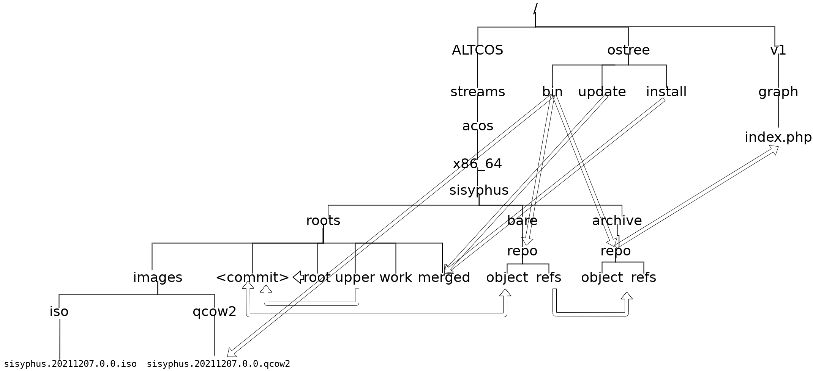

# Конфигурация WEB-сервера

WEB-сервер Apache2 с поддержкой модуля PHP имеет домен
`http://getacos.altlinux.org` с алиасами `http://acos.altlinux.org`, `http://builds.acos.altlinux.org`.

## Установка и настройка WEB-сервера

## Дерево файловой системы WEB-сервера

Дерево файловой системы WEB-сервера выглядит сдежующим образом:

Корневые каталоги:
- `v1/graph`к - PHP-скрипт(ы) сервера графа, обеспечиваюшие доступ к дереву веток репозитория по протоколу `cincinatti`;
- `ostree` - CLI и PHP скрипты создания репозитория и его веток;
- `ACOS` - каталог ostree-репозиториев и промежуточных данных для них.

Каталоги `v1` и `ostree` разворачиваются и поддерживаются из git-репозитория [https://gitea.basealt.ru/kaf/getacos](https://gitea.basealt.ru/kaf/getacos).

Каталог `ACOS` формируется динамически скриптами каталога `ostree` доступны скриптам формирования графа каталога `v1`.

### Структура корневого каталога скриптов `/ostree` и производного каталога репозиториев `/ACOS`

### Структура каталога `/v1/graph` графа протокола `cincinatti`