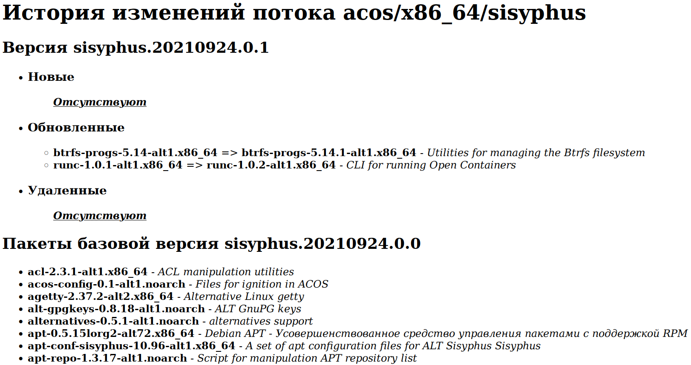

# Работа с пользовательским интерфейсом

Пользовательский интерфейс доступен на порту `80`.
Наберите в боаузере URL: `http://localhost/`. 

Для загрузки образов на локальный компьютер кликните по соответсвующей клавише Скачать.

При кликании на клавише `история изменений` в отдельной вкладке отображается история изменений спсика пакетов 
с полным спискрм базовой версии в конце:

